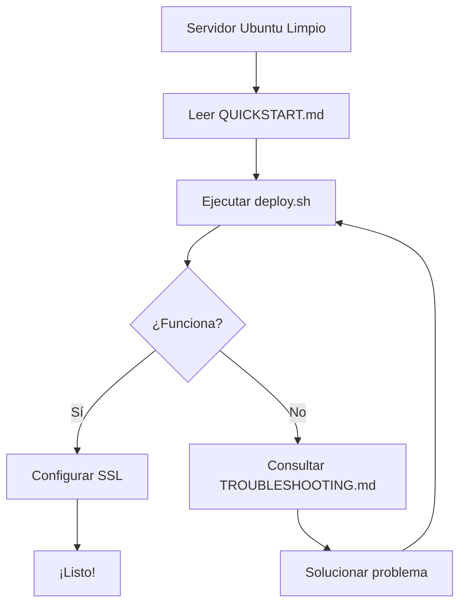
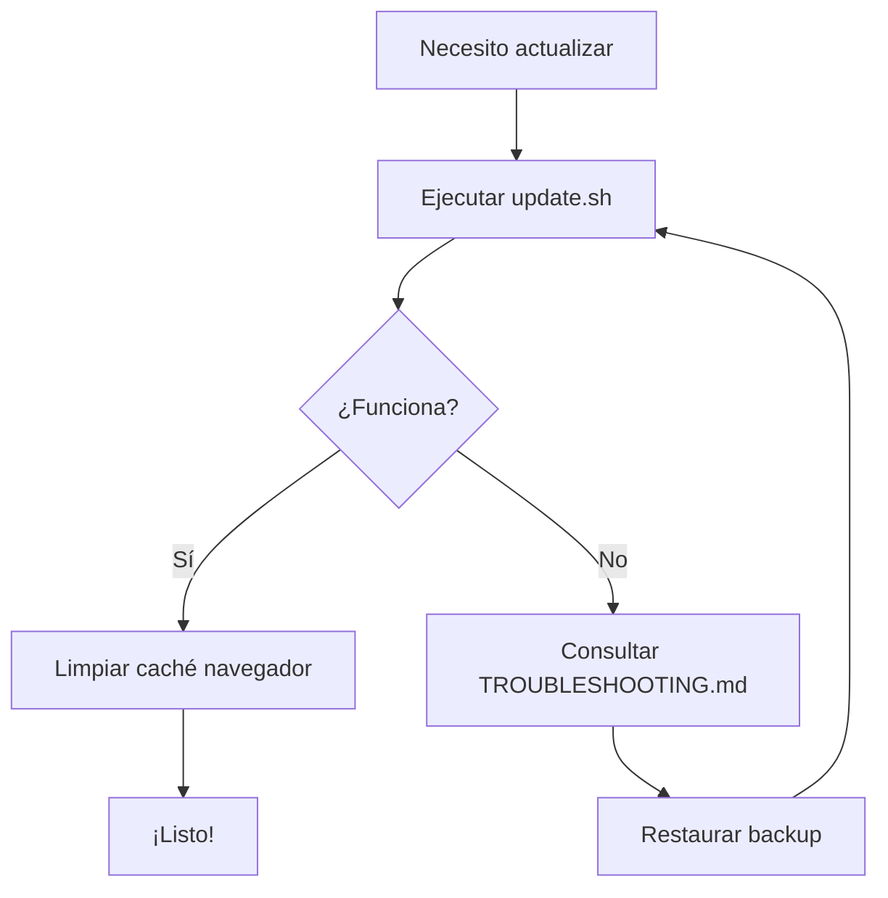
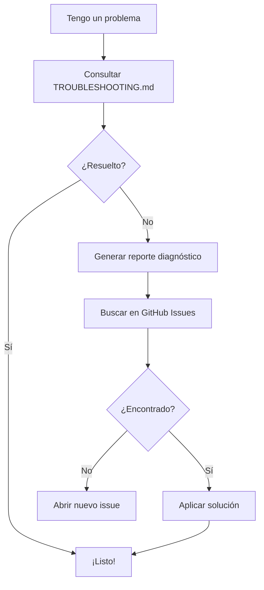

# 📚 Índice de Documentación - QualidApp v60

Guía completa de toda la documentación disponible para el proyecto QualidApp v60.

## 🚀 Inicio Rápido

**¿Primera vez aquí?** Empieza por:

1. **[README.md](README.md)** - Visión general del proyecto
2. **[QUICKSTART.md](QUICKSTART.md)** - Despliegue en 5 minutos

## 📖 Documentación por Categoría

### 🏗️ Para Desarrolladores

| Documento | Descripción | Audiencia |
|-----------|-------------|-----------|
| [README.md](README.md) | Información general del proyecto, estructura, y desarrollo local | Todos |
| [ARCHITECTURE.md](ARCHITECTURE.md) | Arquitectura técnica del proyecto, patrones y decisiones de diseño | Desarrolladores, Arquitectos |
| [CHANGELOG.md](CHANGELOG.md) | Historial de cambios y versiones | Todos |

### 🚀 Para Despliegue y Operaciones

| Documento | Descripción | Audiencia | Tiempo de Lectura |
|-----------|-------------|-----------|-------------------|
| [QUICKSTART.md](QUICKSTART.md) | Guía rápida de despliegue en Ubuntu | Ops, SysAdmins | 5 min |
| [DEPLOY.md](DEPLOY.md) | Guía completa de despliegue con todas las opciones | Ops, SysAdmins | 15-20 min |
| [DEPLOYMENT_SUMMARY.md](DEPLOYMENT_SUMMARY.md) | Resumen de todos los archivos y componentes de despliegue | Ops, SysAdmins | 10 min |
| [TROUBLESHOOTING.md](TROUBLESHOOTING.md) | Solución de problemas comunes | Ops, Soporte | Referencia |

### 🛠️ Scripts y Configuraciones

| Archivo | Tipo | Descripción | Uso |
|---------|------|-------------|-----|
| [deploy.sh](deploy.sh) | Script Bash | Despliegue automatizado en Ubuntu | `sudo ./deploy.sh` |
| [update.sh](update.sh) | Script Bash | Actualización de la aplicación | `sudo update-qualidapp.sh` |
| [nginx.conf.example](nginx.conf.example) | Configuración | Template de nginx | Copiar a `/etc/nginx/sites-available/` |
| [systemd.example](systemd.example) | Configuración | Template de servicio systemd (opcional) | Para casos avanzados |
| [.gitignore](.gitignore) | Configuración | Archivos ignorados por git | Automático |

## 🗺️ Mapa de Navegación

### Tengo un servidor Ubuntu nuevo, ¿qué hago?

```
1. Lee QUICKSTART.md (2 min)
   ↓
2. Ejecuta deploy.sh (3 min)
   ↓
3. Accede desde tu navegador
   ↓
4. [Opcional] Configura SSL con DEPLOY.md
```

### Quiero entender cómo funciona la aplicación

```
1. Lee README.md (visión general)
   ↓
2. Lee ARCHITECTURE.md (detalles técnicos)
   ↓
3. Explora el código en src/
```

### Tengo un problema con el despliegue

```
1. Consulta TROUBLESHOOTING.md
   ↓
2. Si no está resuelto, revisa DEPLOY.md (sección de problemas)
   ↓
3. Genera reporte de diagnóstico (ver TROUBLESHOOTING.md)
   ↓
4. Abre issue en GitHub con el reporte
```

### Quiero actualizar la aplicación

```
1. Usa update.sh
   ↓
2. Limpia caché del navegador
   ↓
3. Si hay problemas, consulta TROUBLESHOOTING.md
```

## 📊 Matriz de Decisión

### ¿Qué documento leer según tu situación?

| Tu Situación | Documento Recomendado | Prioridad |
|--------------|----------------------|-----------|
| Quiero desplegar rápidamente | QUICKSTART.md | 🔴 Alta |
| Necesito despliegue en producción | DEPLOY.md | 🔴 Alta |
| Tengo errores al desplegar | TROUBLESHOOTING.md | 🔴 Alta |
| Quiero entender la arquitectura | ARCHITECTURE.md | 🟡 Media |
| Necesito personalizar nginx | nginx.conf.example + DEPLOY.md | 🟡 Media |
| Quiero contribuir al código | README.md + ARCHITECTURE.md | 🟡 Media |
| Necesito actualizar la app | update.sh + DEPLOY.md | 🟢 Baja |
| Quiero automatizar actualizaciones | systemd.example | 🟢 Baja |

## 🎯 Por Rol

### Si eres Administrador de Sistemas

Documentos esenciales:
1. ✅ [QUICKSTART.md](QUICKSTART.md) - Empezar aquí
2. ✅ [DEPLOY.md](DEPLOY.md) - Referencia completa
3. ✅ [TROUBLESHOOTING.md](TROUBLESHOOTING.md) - Ten esto a mano
4. ⚙️ [nginx.conf.example](nginx.conf.example) - Personalizar si es necesario

### Si eres Desarrollador

Documentos esenciales:
1. ✅ [README.md](README.md) - Visión general
2. ✅ [ARCHITECTURE.md](ARCHITECTURE.md) - Arquitectura técnica
3. ⚙️ [CHANGELOG.md](CHANGELOG.md) - Historial de cambios

### Si eres Usuario Final

Documentos esenciales:
1. ✅ [README.md](README.md) - Qué hace la aplicación
2. ℹ️ [QUICKSTART.md](QUICKSTART.md) - Si necesitas instalarla tú mismo

### Si eres DevOps/SRE

Documentos esenciales:
1. ✅ [DEPLOY.md](DEPLOY.md) - Despliegue completo
2. ✅ [DEPLOYMENT_SUMMARY.md](DEPLOYMENT_SUMMARY.md) - Vista general de componentes
3. ✅ [TROUBLESHOOTING.md](TROUBLESHOOTING.md) - Diagnóstico y solución
4. ⚙️ [systemd.example](systemd.example) - Automatización avanzada

## 🔧 Recursos Técnicos

### Configuración de nginx
- Archivo: [nginx.conf.example](nginx.conf.example)
- Ubicación en servidor: `/etc/nginx/sites-available/qualidapp`
- Documentación: [DEPLOY.md#configurar-nginx](DEPLOY.md#configurar-nginx)

### Scripts de Automatización
- Despliegue: [deploy.sh](deploy.sh)
- Actualización: [update.sh](update.sh)
- Servicios: [systemd.example](systemd.example)

### Logs y Diagnóstico
- Logs de acceso: `/var/log/nginx/qualidapp-access.log`
- Logs de error: `/var/log/nginx/qualidapp-error.log`
- Guía: [TROUBLESHOOTING.md#comandos-útiles-de-diagnóstico](TROUBLESHOOTING.md)

## 📞 Soporte y Ayuda

### Primera línea de soporte
1. **[TROUBLESHOOTING.md](TROUBLESHOOTING.md)** - Problemas comunes y soluciones
2. **[DEPLOY.md](DEPLOY.md)** - Sección "Solución de Problemas"

### Segunda línea
1. Genera reporte de diagnóstico (ver TROUBLESHOOTING.md)
2. Busca en GitHub Issues
3. Abre nuevo issue con el reporte

## 🔄 Flujos de Trabajo Comunes

### Flujo: Despliegue Inicial



### Flujo: Actualización



### Flujo: Solución de Problemas



## 📚 Referencias Rápidas

### Comandos Esenciales

```bash
# Desplegar
sudo ./deploy.sh

# Actualizar
sudo update-qualidapp.sh

# Ver estado
sudo systemctl status nginx

# Ver logs
sudo tail -f /var/log/nginx/qualidapp-error.log

# Verificar configuración
sudo nginx -t

# Recargar nginx
sudo systemctl reload nginx
```

### URLs Importantes

- **Aplicación local**: http://localhost/ o http://servidor-ip/
- **Documentación**: Todos los .md en la raíz del proyecto
- **Repositorio**: https://github.com/moafar/qualidapp-v60

## ✅ Checklist de Documentos

Antes de abrir un issue o pedir ayuda, verifica que has consultado:

- [ ] README.md (para entender qué hace la aplicación)
- [ ] QUICKSTART.md o DEPLOY.md (para instalación correcta)
- [ ] TROUBLESHOOTING.md (para tu problema específico)
- [ ] Logs del sistema (`/var/log/nginx/qualidapp-error.log`)

## 🆕 Última Actualización

Este índice se actualizó: **Diciembre 2024**

Si encuentras alguna información desactualizada o faltante, por favor abre un issue en GitHub.

---

**¿Perdido?** Empieza por [README.md](README.md) para obtener una visión general del proyecto.

**¿Listo para desplegar?** Ve a [QUICKSTART.md](QUICKSTART.md) y en 5 minutos estarás corriendo.

**¿Tienes problemas?** [TROUBLESHOOTING.md](TROUBLESHOOTING.md) tiene la respuesta.
